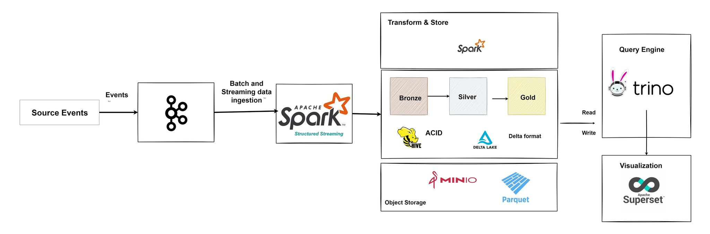
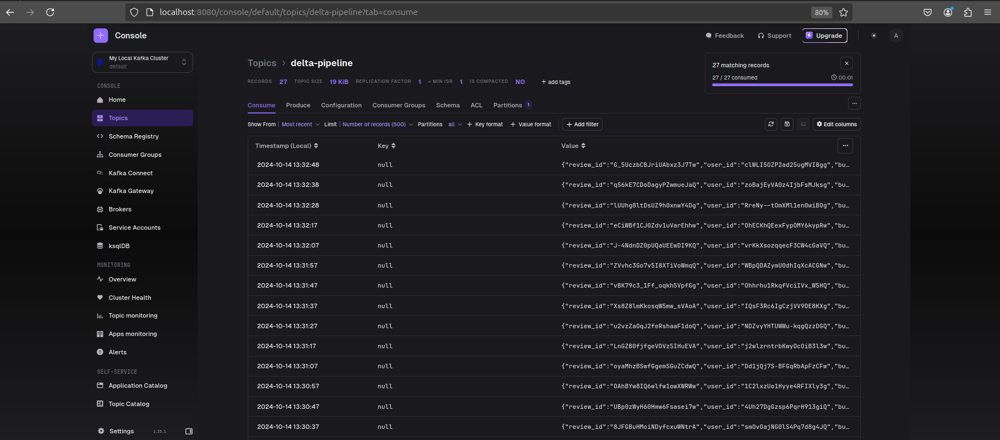
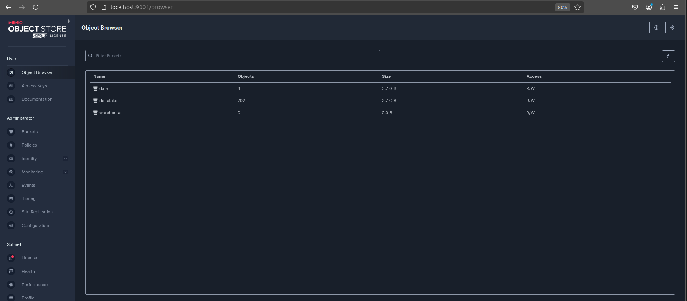
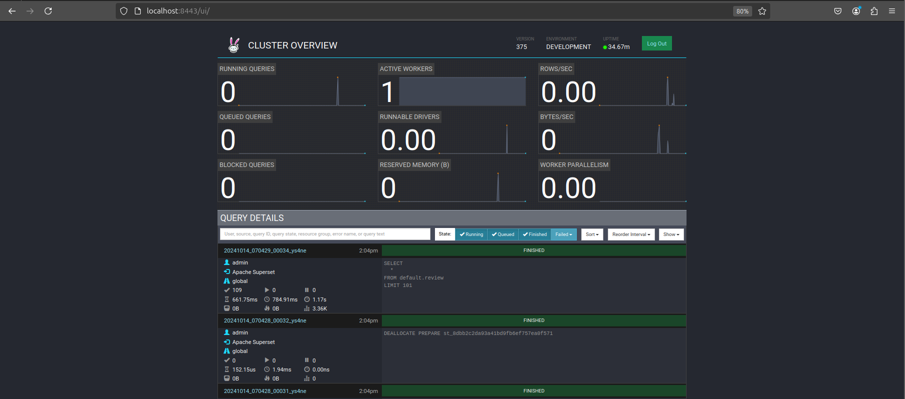
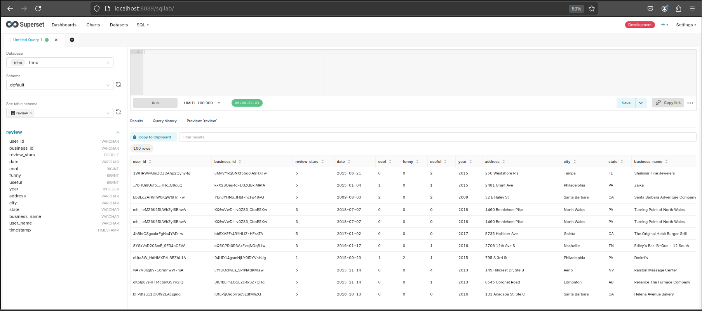

# Yeld Streaming Pipeline - Delta Architecture

## Introduction

Welcome to the **Yeld Streaming Pipeline**, a robust platform built using a **Delta Architecture** to enable real-time data processing and analytics. This system integrates leading technologies to handle distributed processing, real-time streaming, and advanced data visualization.

## Overview

> **Note**: This project is currently a work in progress and not production-ready. Use it at your own risk.

The platform is designed for high-performance real-time data ingestion, processing, and analytics, incorporating the following technologies:

- **Apache Spark** for distributed processing
- **Apache Kafka** for real-time data streaming
- **Hive Metastore** for metadata management
- **MinIO** for S3-compatible object storage
- **Delta Lake** for scalable data storage with ACID transactions
- **Trino** for querying large datasets
- **Apache Superset** for rich data visualizations
- **Jupyter Notebook** for interactive data exploration

## System Architecture

The architecture is built to efficiently handle streaming data from various sources, process and store it in Delta Lake, and offer real-time analytics through tools like Superset and Conduktor. See the diagram for more details:



## Key Components

### 1. **Apache Spark**

Spark powers distributed processing and real-time data ingestion using structured streaming. It enables scalable computation across large datasets.

- **Access Spark UI**: [http://localhost:8082](http://localhost:8082)

### 2. **Apache Kafka**

Kafka handles real-time data ingestion and acts as the backbone for streaming data pipelines.

- **Monitor Kafka with Conduktor**: [http://localhost:8080](http://localhost:8080)
  

### 3. **MinIO**

MinIO provides S3-compatible object storage for storing data processed by Delta Lake.

- **Access MinIO Console**: [http://localhost:9001](http://localhost:9001)
  - Username: `minio`
  - Password: `minio123`
    

### 4. **Trino**

Trino enables querying across multiple data sources, including Delta Lake, with fast and scalable performance.

- **Access Trino**: [http://localhost:8443](http://localhost:8443)
  

### 5. **Apache Superset**

Superset allows for creating and sharing visualizations based on data processed by Spark and stored in Delta Lake.

- **Access Superset Dashboard**: [http://localhost:8089](http://localhost:8089)
  

### 6. **Jupyter Notebook**

Jupyter Notebook facilitates interactive development and data exploration.

- **Access Jupyter Notebook**: [http://localhost:8888](http://localhost:8888)

  **Notebooks**:

  - [Batch Processing](notebooks/Batch_processing.ipynb)
  - [Stream Processing](notebooks/Stream_processing.ipynb)

## Usage Instructions

### Starting Services

To launch all the services, execute:

```bash
make up
```

### Stopping Services

To stop all running services, use:

```bash
make down
```

### Checking Logs

Inspect logs for any service by running:

```bash
make logs
```

### Stopping Kafka Producer

To halt the Kafka producer:

```bash
make producer-stop
```

## Future Enhancements

- Complete integration of advanced streaming pipelines
- Improved analytics and visualizations in Superset
- Enhanced error handling and performance optimization

---
